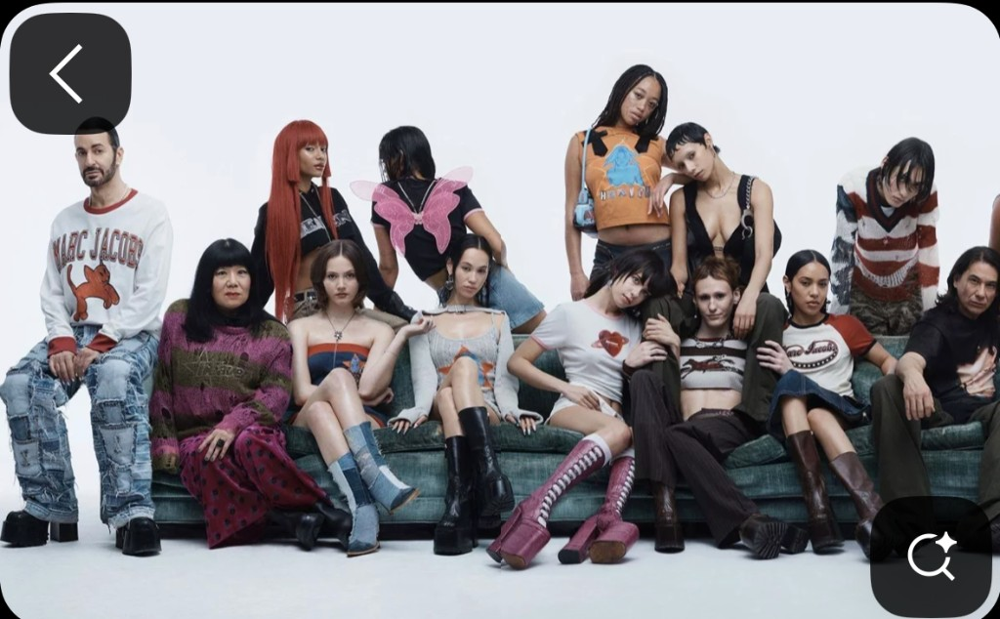
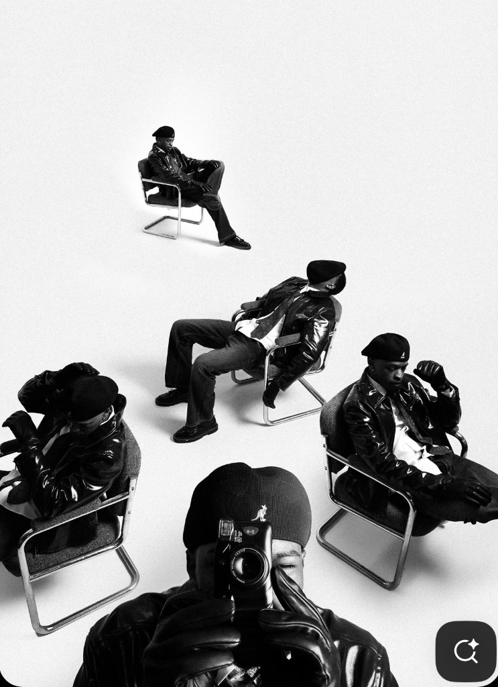

# Steven Christopher — Reference Moodboard

Validated references only. Each entry must be tied to something Steven (or
his music) explicitly endorsed. References beat adjectives — when in doubt
about a design choice, return to this file.

---

## Confirmed website references

### [whatszep.com](https://www.whatszep.com/)

Validated: 2026-05-20.

What Steven valued:
- One-page simple landing.
- Strong, single hero image.
- Links out for everything else — site does not try to contain the whole world.

Study for: hero composition, restraint, the *"links out, not down"* navigation
model.

### [beyonce.com](https://beyonce.com/)

Validated: 2026-05-20.

Study for: minimal nav, single focal asset at a time, the willingness to let
one campaign image *be* the entire homepage.

---

## Confirmed imagery references

Both images below are saved in [`./references/`](./references/) and are
canonical. Steven shared them on 2026-05-20 as direct examples of the visual
direction he wants.

### Image 01 — Marc Jacobs group portrait

Source: Marc Jacobs / Heaven editorial-style group portrait.

Composition and content:

- ~13 subjects seated on a single deep-green velvet sofa against pure white
  seamless.
- Mix of ages, races, body types — group reads like a casting call, not a
  runway show.
- Layered, eclectic styling — distressed Marc Jacobs sweatshirt, vintage
  denim, prints, knits, leathers, platform boots.
- All subjects engage the camera directly; almost none smiling.
- One figure has a pink butterfly graphic over the eyes — the only graphic
  intervention in an otherwise un-decorated frame.
- Composition is wide horizontal with the group anchored in the bottom
  third; white space dominates the top half.
- No type, no logo treatment, no UI. The image is the artifact.

What to study and pull from:

- High-key white seamless as the unifying world.
- Group-as-subject as a valid composition.
- Controlled, dusty palette — green velvet, faded denim, oxblood — never
  bright, never saturated.
- Direct gaze without warmth as the default emotional posture.
- The legitimacy of *layered, art-directed styling* over minimalist
  uniformity — characters can be richly costumed as long as the world stays
  empty.

### Image 02 — Monochrome leather + berets *(music-video opener)*

Steven, 2026-05-20: *"this is what I visualize for the opening of my music
video."* This is the strongest visual signal we have to date.

Composition and content:

- Pure black-and-white, high-key white background.
- Five male figures on tubular cantilever chairs (Breuer Cesca-style
  modernist forms).
- Wardrobe coordinated as costume — all in black leather jackets and black
  berets.
- Triangular composition: foreground figure with a film/point-and-shoot
  camera raised pointing at the viewer; two figures flanking behind him;
  one center mid-ground; one at the back.
- The subject becomes the observer — *the photographed photographing.*
- Chairs catch subtle floor shadows; otherwise the world dissolves into
  white.

What to study and pull from:

- This is the **hero direction** for the website until Steven says
  otherwise. The site should be designed to receive an image in this
  lineage.
- Modernist tubular furniture as part of the world (the literal expression
  of the *futuristic-and-retro* tension as objects).
- Group portrait + uniform wardrobe as a tool for cohesion and gravity.
- The meta photographer-as-subject device — relevant for how the site
  thinks about the artist's gaze and the viewer's gaze.
- Black leather + beret as a wardrobe direction worth holding.

---

## "First frame of the next single" — drums on white

Steven, 2026-05-20:

> *"Me playing the drums, on an all-white background and stage, looking at
> the drums, monochrome."*

A second concrete visualization, paired with image 02 above. Same world:
white seamless, monochrome, controlled composition, subject treated as a
designed object. Differences: solo subject, looking down rather than at
camera.

Properties:

- High-key white environment — not lit theatrically, just present.
- Single subject (Steven + instrument), composed like a still life.
- Monochrome — no color in the world, no color on him.
- Subject is *looking down*, not at the camera. Observed, not performing.
- The viewer arrives mid-moment.

Treat the drums-on-white frame and the monochrome-berets frame as two
moments inside the same visual world. Both are valid hero candidates; the
site's grid should accommodate either.

---

## Visual register references (already in the canonical brief)

These are the directional touchpoints from the brand brief. Use them as
*atmosphere*, not as imitation.

- **Marc Jacobs / Heaven campaign editorial** *(validated 2026-05-20)* — the
  primary photographic lineage for hero / portrait imagery.
- **Wales Bonner, Mowalola, Telfar lookbooks** — controlled monochrome,
  costumed bodies, mid-century props.
- **Saint Laurent, Calvin Klein archival campaign work** — restraint,
  uniformity, designed staging.
- **A24 film aesthetics** — composition, restraint, mood. Atmosphere only —
  not the literal photography lineage.
- **Frank Ocean, *Blonde* / *Endless* era** — light, restrained, designed
  covers; willingness to under-explain.
- **Pharrell** — multi-disciplinary taste; design-first thinking.
- **Brent Faiyaz** — emotional detachment carried visually with restraint.
- **Prince** — confident sensuality, artistry over commerce.

---

## Anti-references — what we are not

If a proposed design feels closer to any of these than to the references
above, replace it.

- Squarespace / Webflow / Wix artist templates.
- Influencer-personal-brand sites with hero headline + CTA stacks.
- SaaS-style "Music / About / Contact" three-column feature rows.
- Glossy pop-star campaign sites with full-bleed retouched portraits and
  bright color blocking.
- Sci-fi / glitch / cyberpunk pastiches that confuse *futuristic-and-retro*
  with *futuristic costume.*
- Romantic, italic-serif "fashion magazine" templates — the look Steven
  rejected as *"squirly squiggly round."*

---

## How to use this file

1. Before designing a new variant or hero, read this file end-to-end.
2. When generating imagery, cite the specific reference you are pulling from.
3. When in disagreement about a direction, the website references and the
   *"first frame"* description are the tiebreakers.
4. New references are only added here after Steven has named them in a
   review. Do not seed this file with our own taste.
